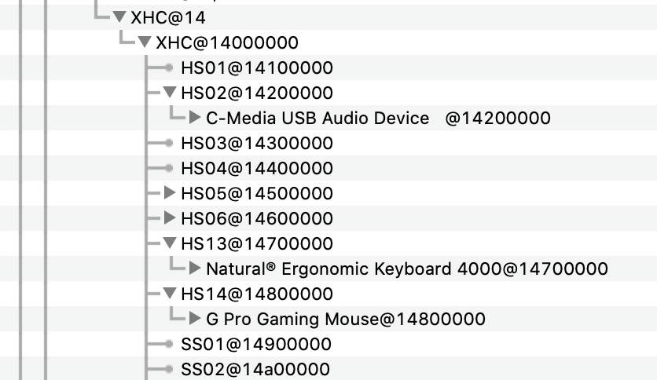
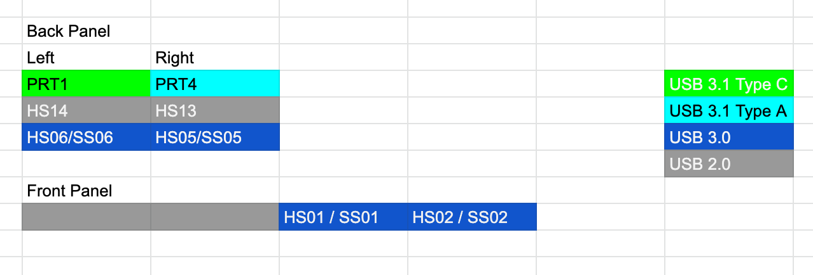

# Overview

Give the USB wiki page a quick readover for a refresher: https://en.wikipedia.org/wiki/USB

USB 3.x ports are physically backwards compatible with USB 2.0 (pin compatible), this means that the same physical hardware USB 3.0 port can get (and most likely will be) mapped to two macOS ports: a USB 2.0 and a USB 3.0 port. 

eg. if you have six USB 3.0 ports on the back of the motherboard, there will be six USB 2.0 and six USB 3.0 for a total of 12 ports available in macOS. 

According to Asus' site, here are the specs for the Prime Z370A-II motherboard:

ASMedia® USB 3.1 Gen 2 controller:
* 1 x USB 3.1 Gen 2 port(s) (1 at back panel, teal blue, Type-A, Support 3A power output)
* 1 x USB 3.1 Gen 2 port(s) (1 at back panel, , USB Type-CTM, Support 3A power output)

Intel® Z370 Chipset :
* 6 x USB 3.1 Gen 1 port(s) (2 at back panel, , 4 at mid-board)
* 6 x USB 2.0 port(s) (2 at back panel, , 4 at mid-board)

# OpenCore configuration
Boot with:
* USBInjectAll.kext
* Kernel / Quirks / XhciPortLimit = true
  * this will remove the 15 port limit and allow USBInjectAll.kext to inject all your ports, without it you will only see 15 ports in IORegistryExplorer (typically of which 14 are USB 2.0 devices - **HS01** - **HS14**, **USR1**). After enabling this quirk **HS01** - **HS14**, **SS01** - **SS10**, **USR1** - **USR2** is visible. 
  
# Using IORegistryExplorer
IORegistryExplorer
* Intel Chipset Controller will show under: **PCI0@0 / AppleACPIPCI / XHC@14**
  * HSxx = USB 2.0 port
  * SSxx = USB 3.0 port
* ASMedia 3.1 gen2 Controller will show under: **PCI0@0 / AppleACPIPCI / ... / PXSX@0**
  * PRTx = USB 3.1 gen2 port 

Once a USB device is plugged into a hardware port, it should show up underneath the respective OS port in IORegistryExplorer, eg:

# Mapping Ports

## Finding Port Names

Use a USB 2.0 **ONLY** device (I used this https://smile.amazon.com/gp/product/B001MSS6CS, old USB drive or keyboard is another posibility) and plug it into each port and check IORegistryExplorer to see under which OS port (HSxx) it shows up, make note of the name on a diagram. Similarly, use a USB 3.x device to find all your USB 3.0 (SSxx) ports:

https://docs.google.com/spreadsheets/d/1gyjzlDIoYTZ1Lw6ZPTIgHuKZwrB_kTjxa_0HbAqcy4U/edit?usp=sharing

As expected, the hardware ports that are blue (USB 3.0 ports), shows as both HSxx and SSxx ports as they are backwards compatible. 

Use System Information app (About This Mac), in the USB section click on the USB 3.0 bus and find the PCI Device ID, for Z370 it should be *0xa2af*, the PCI Vendor ID should be *0x8086* (Intel).

## Defining your Ports
Download https://raw.githubusercontent.com/RehabMan/OS-X-USB-Inject-All/master/SSDT-UIAC-ALL.dsl and find the section relevant to you, in this case ""8086_a2af", Package()" and delete the other unneeded sections. Remove or uncomment the ports in this section that you do not want to use to bring the total down to 15 or fewer ports. Modify the USB connector value as appropriate:

* 3: USB 2.0 or USB 3.0 port
* 9: USB-C port (same OS port name for USB 3 and USB 2)
* 10: USB-C port (different OS port name for USB 3 and USB 2)
* 255: internal port

Compile the DSL with MaciASL and save as AML, copy it to EFI/EFI/OC/ACPI and add to *config.plist* (make sure the ACPI is enabled). Set Kernel / Quirks / XhciPortLimit back to false. Make sure **USBInjectAll.kext** is still enabled. Reboot and check IORegistryExplorer. 

# Quirks

Some USB 3.0 devices (eg SanDisk Ultra Flair 32GB USB 3.0 Flash Drive - SDCZ73-032G-G46) are compatible with USB 2.0 and USB 3.0 and for some reason are connected as USB 2.0 device (480mbit/s - check System Information) in the motherboard USB 3.0 ports while connected as a USB 3.0 device (5gbit/s) using the front (case) USB 3.0 ports. 
Both sets of ports are mapped as HSxx & SSxx ports. 
Other USB 3.0 devices such as a hub (https://smile.amazon.com/gp/product/B01MQD0HDU) that also supports both standard, is correctly connected as a USB 3.0 (5gbit/s) device when plugged into the motherboard USB 3.0 port. 